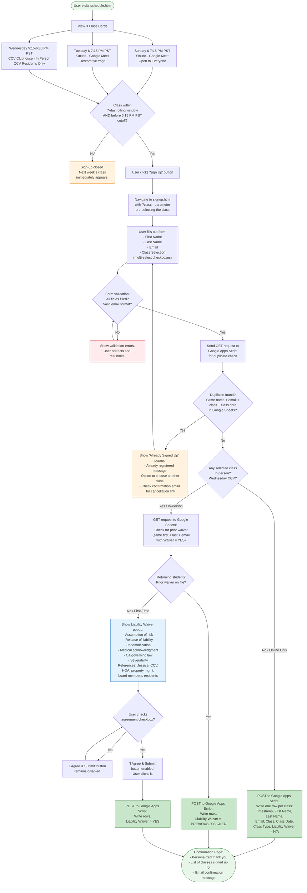
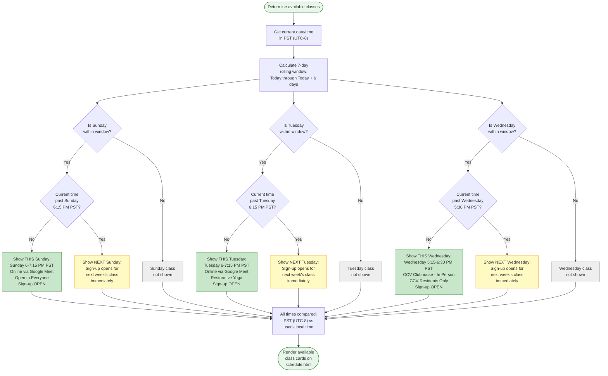
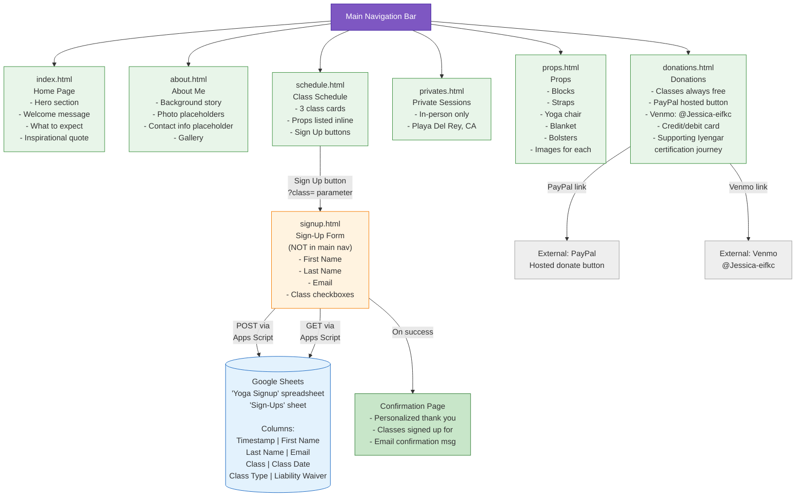
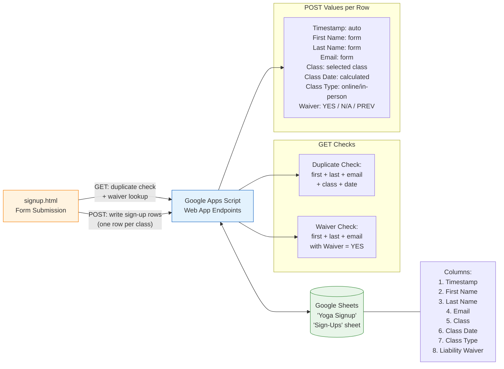
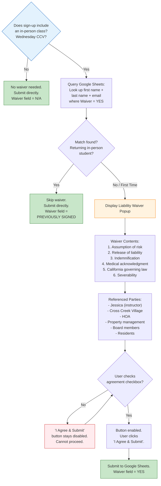
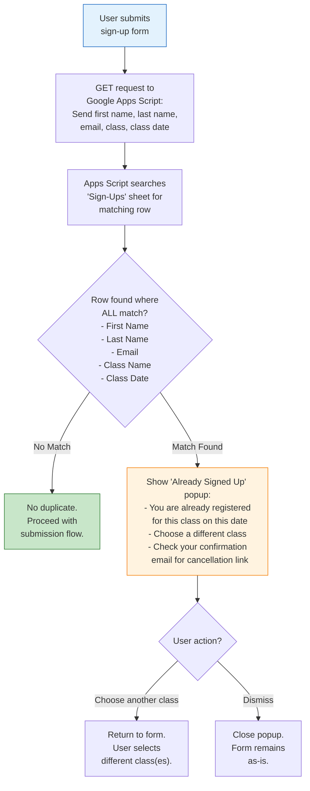

# Yoga Website Business Rules - Flowchart Documentation

## How to View These Diagrams

- **GitHub**: Push this file to a repository; GitHub renders Mermaid blocks natively.
- **VS Code**: Install the "Markdown Preview Mermaid Support" extension, then open Markdown preview (`Cmd+Shift+V`).
- **mermaid.live**: Copy any individual `mermaid` code block into [https://mermaid.live](https://mermaid.live) for live editing and PNG/SVG export.
- **Obsidian / Notion**: Both render Mermaid blocks natively in their Markdown views.

---

## 1. Main Sign-Up Flow

This is the primary diagram covering the full journey from visiting the schedule page through form submission, duplicate checks, waiver logic, and confirmation.

---

## 2. Class Availability Logic

This diagram details the rolling 7-day window and cutoff time logic that determines which classes are available for sign-up at any given moment.

---

## 3. Page Structure / Sitemap

This diagram shows the website's page hierarchy, navigation structure, and how pages connect to each other.

---

## 4. Quick Reference: Google Sheets Data Flow

---

## 5. Liability Waiver Decision Tree

---

## 6. Duplicate Registration Check

